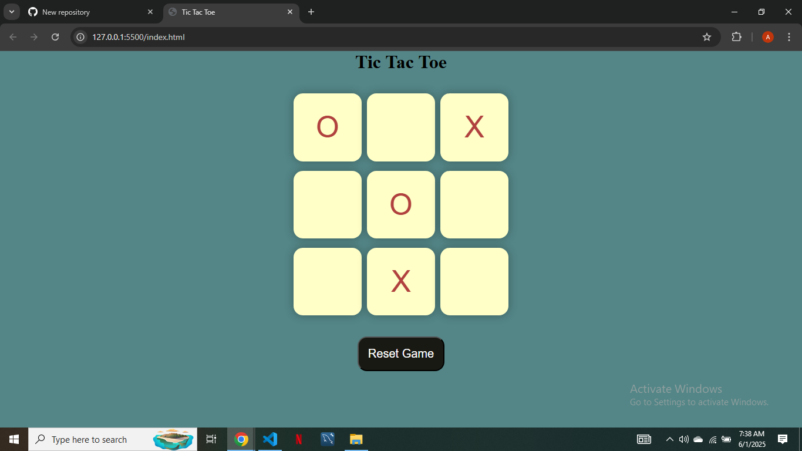

# ✖️ Tic Tac Toe Multiplayer Game

A classic **Tic Tac Toe** game that lets you play against a friend in real-time on the same device. Built with **HTML**, **CSS**, and **Vanilla JavaScript**, this simple yet engaging game is perfect for quick fun and challenge.

## 🚀 Features

- Two-player multiplayer game on the same device  
- Clean and intuitive user interface  
- Real-time game status updates (win, lose, draw)  
- Reset game option to start a new match  

## 🛠️ Tech Stack

- HTML5  
- CSS3  
- JavaScript (Vanilla)

## 📸 Screenshot

## 🎯 Live Demo

[Click here to play](https://sheikh-abubakr-faisal.github.io/tic-tac-toe-multiplayer/)

## 👨‍💻 Author

**Sheikh Abubakr Faisal**  
[abubakrsheikh44@gmail.com](mailto:abubakrsheikh44@gmail.com)

## 📄 License

This project is for learning purposes only.
